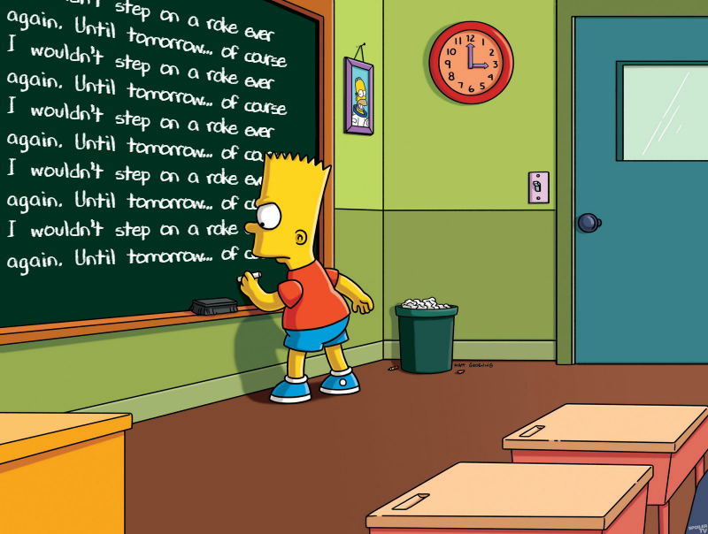

Этот пост является первым постом в серии "Заметки из Code review". В рамках этих постов
мы будем говорить о код ревью и рассматривать примеры ошибок, которые совершаются
в реальной жизни и на реальных проектах. Будем пытаться улучшать свой код и
код своих коллег. Учиться на ошибках и разбираться, почему тот или иной код заострил на себе
внимание во время код-ревью. Как подобный код исправить и избежать повторения ошибок
в будущем.
Человечество так устроено, что единственное, что у него получается блестяще,
так это совершать ошибки. И один из способов научиться их не совершать - это учиться на
ошибках других. Итак начнем.<more/>

## Зачем об этом писать?

Может показаться, что смысла в подобных статьях не очень много (и, возможно, так оно и есть...). И на
это есть множество разных причин. Начиная с вопроса: зачем выносить сор из избы? Заканчивая тем, что
пользы от подобных статей немного, т.к. у всех свой, разный, непохожий на остальных опыт и,
соответственно, грабли тоже отличаются.

На мой взгляд, подобные статьи полезны по многим причинам. Во-первых, далеко не в каждой
компании делается код-ревью (к большому сожалению). И уж тем более не так много компаний делают
код-ревью должным образом. Отсюда и возникает ситуация, когда разработчик имеет некоторый опыт
 (порой даже в нескольких компаниях), солидное резюме, но по факту не умеет писать
хороший код. К сожалению, такое происходит сплошь и рядом. На это может быть десятки разных причин,
начиная от нехватки времени, специалистов, заканчивая отсутствием соответствующей культуры
разработки. Таким образом, должно быть очевидно, что потребность в подобных статьях,
особенно среди начинающих разработчиков, должна быть.

На второй момент так же легко дать ответ. Как бы это странно ни было, но большинство
разработчиков (особенно начинающих) делают довольно похожие ошибки. Возможно и существует
вселенная, где каждый наступает на свои, ни на чьи не похожие, грабли, но в нашей это не так. Само
собой, мы говорим об общей структуре ошибок/проблемном коде, а не о частностях. Из-за этого приходится
писать на код-ревью довольно похожие комментарии. Расписать пару раз (порой довольно обширное)
объяснение проблемы в комментариях к _MR_'у может быть и не так напряжно. Но писать одно и то же
десятки раз довольно быстро утомляет. А это довольно сильно сказывается на качестве код-ревью.
А мы все-таки здесь пытаемся говорить о качественном код-ревью. 



Люди так устроены, что, несмотря на многократные попытки разъяснить какие-то моменты, обсуждения и
комментарии к _MR_'у, это ровным счетом никак не гарантирует, что тот же самый разработчик не
совершит ту же самую ошибку не далее, чем завтра, в соседнем _MR_'е. Таким образом, написание подобных
постов должно помочь как твоим коллегам, так и тебе (не придется описывать проблемные места довольно
дотошно каждый раз, а можно указать ссылку на пост), так и другим разработчикам, у которых просто
нет возможности быть хорошо проревьювенными.

Сегодня мы рассмотрим первый небольшой пример из реальной жизни. Все совпадения случайны)

## Flutter и синтаксический сахар

Ближе к делу, рассмотрим следующий кусок кода:

```dart
    icon: Stack(
        clipBehavior: Clip.none,
        children: [
          Assets.icons.bell.svg(),
          if (notificationsCount > 0) ...{
            Positioned(
              top: -5,
              right: -5,
              child: Container(
                width: 10,
                height: 10,
                decoration: BoxDecoration(
                    color: selectedColor,
                    borderRadius: BorderRadius.circular(10)),
              ),
            )
          }
        ],
    ),
```

Прежде чем написать об основной проблеме этого кода, попробуйте найти ее сами.
Это довольно полезное упражнение. Итак...

Это обычный _Flutter_ код с разметкой некоторого виджета. С подобным кодом
_Flutter_ разработчики встречаются каждый божий день. На первый взгляд может даже показаться,
что никаких особых проблем с этим кодом нет. Код как код. Но если присмотреться, то
кое-что может показаться странным. Странно то, как именно добавляется индикатор наличия
уведомлений. Конкретно нас интересует следующий фрагмент кода:

```dart
if (notificationsCount > 0) ...{

}
```

Что же здесь происходит, и что хотел автор добиться этим кодом?
Все просто: если количество уведомлений больше нуля (т.е. если есть
хотя бы одно уведомление), то необходимо отобразить индикатор новых
уведомлений поверх иконки уведомлений. Я был довольно сильно удивлен, увидев
подобный код. Само собой, это далеко не самый ужасный код, который можно
увидеть в реальном проекте, но все же было неожиданно.

Начнем с того, что в данном конкретном виде этот код работает. Несмотря на то,
что, в общем случае, так писать, однозначно, не стоит, попадание именно этого
куска кода в прод особо ничего не сломало бы, наверное... Не советую экспериментировать.
Если рассматривать более общий случай, то будет понятно, что этот безобидный (на первый взгляд)
код нельзя пропускать далее _MR_'а. Это как раз одна из причин, почему делать код-ревью нужно, и делать
это нужно на постоянной основе.

Если подобный код просочится в основную кодовую базу, это, с большой
вероятностью, приведет к тому, что другие разработчики могут начать писать
аналогичный код. А дальше еще шаг - и хаос...

Для добавления индикатора в дерево виджетов в этом
коде используется `...` [spread оператор](https://dart.dev/guides/language/language-tour#spread-operator)
и `{}` [set literal](https://dart.dev/guides/language/language-tour#sets).
Таким образом, если переписать этот код без синтаксического сахара (который, возможно частично и
скрывает проблему), то мы получим код следующего вида:

```dart
    List<Widget> children = [Assets.icons.bell.svg()];
    if (notificationsCount > 0) {
        children.addAll({
            Positioned(
              top: -5,
              right: -5,
              child: Container(
                width: 10,
                height: 10,
                decoration: BoxDecoration(
                    color: selectedColor,
                    borderRadius: BorderRadius.circular(10)),
              ),
            )
          });
    }
    icon: Stack(
        clipBehavior: Clip.none,
        children: children,
    ),

```

Таким образом _spread_ оператор был заменен на явный вызов метода
`List.addAll`. И теперь код стал чуточку более явным и прямолинейным.
И если его еще упростить, то мы получим следующий код:

```dart
    List<Widget> children = [Assets.icons.bell.svg()];
    if (notificationsCount > 0) {
        Set<Widget> indicator = {
            Positioned(
                top: -5,
                right: -5,
                child: Container(
                width: 10,
                height: 10,
                decoration: BoxDecoration(
                    color: selectedColor,
                    borderRadius: BorderRadius.circular(10)),
                ),
            )
        };
        children.addAll(indicator);
    }
    icon: Stack(
        clipBehavior: Clip.none,
        children: children,
    ),

```

После того, как мы "смыли" весь синтаксический сахар, стало еще более наглядно видно, в чем же
проблема. Получается, что для добавления виджета индикатора в список
отображения этот код создает временное множество (`Set`), состоящее из одного элемента (виджета
индикатора). Используя тот факт, что метод `List.addAll` принимает любое перечисление `Iterable<T>`,
а множество (`Set`) является перечислением, этот код работает "как надо". Может показаться, что
основная проблема этого кода в том, что создается временный, да еще и относительно "тяжелый" объект
\- множества.

## Как исправить код?

Разобравшись с корнем проблемы, давайте разберемся, как нужно было написать этот код. На самом деле
ничего сложного нет:

```dart
    icon: Stack(
        clipBehavior: Clip.none,
        children: [
          Assets.icons.bell.svg(),
          if (notificationsCount > 0) 
            Positioned(
              top: -5,
              right: -5,
              child: Container(
                width: 10,
                height: 10,
                decoration: BoxDecoration(
                    color: selectedColor,
                    borderRadius: BorderRadius.circular(10)),
              ),
            )
        ],
    ),
```

Да, в данном конкретном примере все так просто. Мы не используем ни _spread_ оператор `...`, ни
_set literal_ `{}`. Такой код не создает временных объектов и работает максимально прозрачно. Он
прост в понимании, и именно к такому коду и стоит стремиться. Если мы избавимся от синтаксического
сахара в этом примере, то код будет выглядеть примерно так:

```dart
    List<Widget> children = [Assets.icons.bell.svg()];
    if (notificationsCount > 0) { 
        children.add(
            Positioned(
              top: -5,
              right: -5,
              child: Container(
                width: 10,
                height: 10,
                decoration: BoxDecoration(
                    color: selectedColor,
                    borderRadius: BorderRadius.circular(10)),
              ),
            )
        );
    }
    icon: Stack(
        clipBehavior: Clip.none,
        children: children,
    ),
```

В этом коде все максимально прозрачно (хотя и несколько подробно), и вероятность сделать ошибку 
также минимальна.

## Акт второй

Как уже ранее было сказано, людям свойственно наступать на одни и те же грабли. И это нормально). Но
печально... Давайте рассмотрим фрагмент кода буквально одного из следующих _MR_'ов:

```dart
Row(
    children: [
    if (avatarImageName != null) ...{
          Text(ln.welcome),
          Text(ln.profileName(profileName)),
        } else ...{
          Text(ln.homeScreenTitle),
        }
    ],
),
```

Если предыдущий фрагмент кода с (большой) натяжкой можно было пропустить, то здесь уже все
несколько хуже. Давайте разбираться, что же с этим кодом не так, и чем же этот фрагмент кода,
с виду очень похожий на предыдущий, гораздо хуже?

Очевидно, что все проблемы, описывающие предыдущий фрагмент кода, присущи и этому. И часть проблем
мы уже знаем как поправить:

```dart
Row(
    children: [
    if (avatarImageName != null) ...{
          Text(ln.welcome),
          Text(ln.profileName(profileName)),
        } else 
          Text(ln.homeScreenTitle),
    ],
),
```

Ветка `else` была отрефакторена аналогично предыдущему примеру. Но выполнить
аналогичный манёвр с первой частью условия `if`, увы, не получится. Единственно, что мы можем (и
должны) сделать, - это заменить множество `Set` на список `List`. Теперь код будет выглядеть так:

```dart
Row(
    children: [
    if (avatarImageName != null) ...[
          Text(ln.welcome),
          Text(ln.profileName(profileName)),
        ] else 
          Text(context.ln.homeScreenTitle),
    ],
),
```

Теперь, несмотря на временное создание объекта (списка), код хотя бы стал корректным и делает
именно то, что задумал автор. Так почему же код вида:

```dart
Row(
    children: [
    if (condigtion) ...{
            widgetA,
            widgetB,
        } 
    ],
),
```

не корректен? Вроде бы, код не сильно отличается от предыдущего варианта, который мы посчитали
условно-~~съедобным~~корректным. Что же здесь не так? При запуске все работает,
как и должно работать. Подумайте, прежде чем читать ответ. Можете представить, что подобный код
попался вам на код-ревью. Как бы он был бы прокомментирован вами? Это очень полезное упражнение,
вне зависимости от вашего уровня.

Давайте обратимся к [документации](https://dart.dev/guides/language/language-tour#sets):

> A set in Dart is an ***unordered*** collection of unique items. Dart support for sets is provided
> by set literals and the Set type.

Теперь основная проблема кристально понятна - порядок итерации множества не гарантирован! А это 
значит, что виджеты в дереве отображения могут отобразиться в разном порядке.
Очевидно, что это совсем не то, что автор _MR_'а хотел реализовать. Как и всегда, дьявол кроется
в деталях. Вполне безобидный код может таить в себе довольно неприятные сюрпризы. 

## Почему данный код вообще работает?

Мы выяснили, что проблемное место - не гарантированный порядок обхода множества. Тогда логично
задаться вопросом, почему данный код все время работает? Разве не должен порядок виджетов
быть рандомным и зависеть от фазы луны?

Все довольно просто. Если обратиться к [документации](https://api.dart.dev/stable/2.18.2/dart-core/Set-class.html)
к классу `Set`, то вот что мы узнаем:

> The default `Set` implementation, `LinkedHashSet`, ...

> Iterating over elements of a set may be either unordered or ordered in some way.
> Examples:
> - A HashSet is unordered, which means that its iteration order is unspecified,
> - LinkedHashSet iterates in the insertion order of its elements, and
> - a sorted set like SplayTreeSet iterates the elements in sorted order.

Таким образом, по умолчанию реализация множества использует `LinkedHashSet`, который,
в свою очередь, итерирует элементы в последовательности добавления. Это и есть причина того, что
рассматриваемый код генерирует корректную последовательность виджетов.

Отсюда же вытекает следующий вопрос: а раз нет разницы, то возможно такой код стоит использовать?

На мой взгляд, ответ очевиден - конечно, нет. Документация явно говорит, что порядок обхода элементов
множества не задан и может отличаться в зависимости от используемой реализации множества. Другими
словами, код такого рода можно назвать хрупким и ненадежным. В любой момент он может перестать
работать. Например, команда _Dart_'а может решить, что реализация множества недостаточно быстрая и
заменить ее на какую-то другую реализацию. В таком случае как раз очень велика вероятность того,
что подобный код сломается. И такое вполне может случиться. Учитывая то, что `Set` в своем контракте
указывает, что порядок не задан, у разработчиков _Dart_'а развязаны руки. И такое вполне может произойти.
Также стоит помнить, что флаттер проекты собираются под множество платформ - мобильные, десктоп,
серверные и веб. И реализация множества для каждой конкретной платформы может отличаться.

Другая причина, почему не стоит писать такой код - это его непрозрачность. Код должен быть максимально
явным и надежным. Здесь же куча синтаксического сахара скрывает довольно много деталей и сильно
усложняет код. И давайте представим, что такой и ему подобный код разросся по проекту. Поддерживать такой 
код будет довольно мучительно.

## Откуда такой код мог взяться?

Стоит уделить минутку и подумать, откуда такой код вообще мог появиться.

Конечно, на 100% выяснить, откуда и как такой код появился на свет, мало реально. Но вот некоторые 
возможные варианты, которые могли иметь место: 

- маловероятно, что такой код был кем-то написан на предыдущем месте работы. Хотя и
полностью исключать такой вариант нельзя;
- можно предположить, что автор этого кода где-то когда-то видел код вида `...[ ]` или подобный,
но до конца не разобрался или не запомнил всех нюансов: 
- более вероятный вариант - автор кода столкнулся с моментом, когда необходимо
было добавить более одного виджета в список отображения в зависимости от некоторого условия,
а код вида `if () {}` не работал как нужно, и тогда на свет вполне мог появиться код вида
`if () ...{}`. У автора кода могло на интуитивном уровне сложиться впечатление, что эти два куска
кода идентичны, хотя это и не так.

## Двусмысленность синтаксиса Dart`а

Язык _Dart_ поддерживает довольно удобный синтаксис объявления коллекций, который называется
_List/Set/Map_ comprehension. Не знаю, как этот термин лучше перевести на русский язык. Благодаря
этой возможности, мы можем писать код следующего вида:

```dart
  final condition = true;
  final myList = [1, 2, 3, if (condition) 4];
  final mySet = {1, 2, 3, if (condition) 4};
  final myMap = {1:1, 2: 2, 3: 3, if (condition) 4: 4};
  print(myList); // prints [1, 2, 3, 4]
  print(mySet);  // prints {1, 2, 3, 4} 
  print(myMap);  // prints {1: 1, 2: 2, 3: 3, 4: 4}
```

_Collection comprehension_ синтаксис позволяет создавать и инициализировать разные коллекции
с довольно сложным содержимым; при этом код остается компактным и читаемым.

Теперь давайте рассмотрим следующий код:

```dart
  final condition = true;
  final children = [
    Text('bar'),
    if (condition) {
      Text('foo'),
    },
  ];
  print(children);
```

и вот этот фрагмент кода:

```dart
 final condition = true;
 final children = [Text('bar')];
 if (condition) {
  children.add(Text('foo'));
 }
 print(children);
```

Может показаться, что код идентичен. Но это не так. Если посмотреть на то, что будет распечатано,
то в первом случае мы увидим:

```
[Text("bar"), {Text("foo")}]
```

а во втором:

```
[Text("bar"), Text("foo")]
```

Мы получаем два списка, но с разными типами и разным содержимым. В первом случае будет
`List<Object>`, а во втором `List<Text>`.

В итоге код из первого случая нельзя использовать для построения дерева виджетов, т.к. стандартные
виджеты принимают список виджетов `List<Widget>`. Каждый элемент такого списка является виджетом.
В нашем же случае элементы списка имеют тип `Object`, и такой код не скомпилируется. Второй элемент
нашего списка - это множество, состоящее из одного виджета. Как уже выше было отмечено, из-за того,
что `Set` реализует `Iterable<T>` и использует _List Comprehension_ синтаксис вкупе с
_Spread operator_`ом код, рассматриваемый в нашей статье и получился. Еще раз обратите внимание на
следующий момент:

```dart
[
    Text('bar'),
    if (condition) {
      Text('foo'),
    },
  ]
```

Здесь фигурные скобки создают множество (_Set_), а не область видимости (_Scope_) для _if statement_.
Как раз из-за этой двусмысленности в языке, а, как следствие, и возможности ошибиться, и возникла эта
статья.

### Выводы

Даже вполне безобидный код может делать совсем не то, что кажется. Подобный код, если бы не проходил
качественный процесс код-ревью, вполне мог попасть в основную кодовую базу, и даже довольно сильно
распространиться по ней. Крайне маловероятно, что подобную проблему малоопытный разработчик
смог бы заметить сам. Про такое не пишут в книгах (по крайней мере явно) и документации, и
разобраться без сторонней помощи может быть непросто. 

Основной вывод, который можно сделать из этого поучительного ревью: необходимо всегда понимать, что
твой код делает. Даже в таких мелочах. Код не должен работать каким-то магическим способом. Все 
должно быть кристально ясно и понятно, как автору, так и его коллегам. Учите мат. часть)
