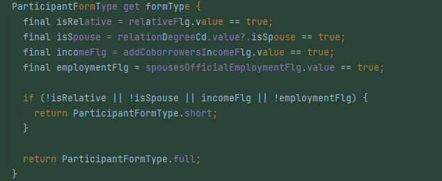
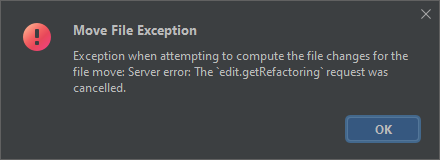

[_Flutter_](https://flutter.dev/) - довольно популярный фреймворк для разработки кроссплатформенных приложений. В основном это
приложения под _Android_ и _iOS_, но все же имеется возможность разрабатывать и под другие платформы,
хотя в большинстве случаев еще не все так гладко по сравнению с основными платформами. Этот
фреймворк уже сейчас имеет некоторую фан базу, которая, как и положено фан базе, генерирует статьи о
том, какой _Flutter_ клевый, крутой, интересный и производительный и т.п. В этих статьях _Flutter_ часто
сравнивается с конкурентами, и чаще всего он описан в положительном свете. Ни в коем случае не
пытаюсь как-то умалить его заслуги, но... работая с ним ежедневно, вольно или невольно начинаешь
замечать неприятные и раздражающие моменты, с которыми приходится жить. Именно об этих моментах
сегодня и пойдет речь.<more/>

Конечно, стоит учитывать, что и _Dart_, и _Flutter_ являются относительно молодыми продуктами, и многие
проблемы, описанные здесь, в будущем, скорее всего, будут исправлены. Но хотелось бы, чтобы это светлое
будущее наступило скорее). Само собой, я буду говорить о том, что не нравится именно мне, и мое мнение
может (и будет) не совпадать с вашим. И это нормально. Также не стоит принимать все близко к
сердцу. Критика (надеюсь, конструктивная) ниже - только для того, чтобы подсветить и направить. Было
бы здорово, если бы вы в комментариях поделились своими мыслями по этому поводу.

Глобально все "раздражение" я разделил на 3 основные части:

- проблемный дизайн _Dart_ как современного ЯП;
- средства разработки (_IDE_ и _tooling_), которые иногда не только не помогают, но и немножечко вредят;
- ограничения _Flutter_, которых могло и не быть.

# Проблемы в дизайне _Dart_, с которыми приходится жить

_Dart_ как язык программирования можно отнести к современным. На данный момент ему всего 11 лет.
_Dart_ еще даже не подросток). Изначально _Dart_ разрабатывался и позиционировался как язык, созданный
для исправления фундаментальных изъянов _JavaScript_, которые иначе никак не возможно исправить.
Несмотря на высокопарные заявления и благие цели, думаю, на сегодняшний день вполне очевидно, что со
своей задачей (стать убийцей _JavaScript_) _Dart_ не справился. Но _Dart_ не был заброшен (как обычно
это принято в _Google_) и в принципе стал развиваться абсолютно в другом направлении. Возможно, это
и к лучшему.

Работая с _Dart_, невольно задаешься вопросом: а для чего он вообще существует? Что нового _Dart_ привнес
в нашу жизнь? Чем он так хорош? Почему было необходимо создавать новый ЯП? Чем
сотни [ранее существующих ЯП](https://github.com/ChessMax/awesome-programming-languages) не угодили?
И на эти вопросы довольно непросто получить удовлетворительный ответ. Каковы предпосылки в
реализации нового ЯП? Было ли оправдано создание нового ЯП?

Новый ЯП создается обычно в следующих случаях:

- исправление фундаментальных недостатков другого ЯП, исправить которые другим способом не
  представляется возможным (обратная совместимость и все такое);
- реализация и апробация каких-то новых, зачастую инновационных идей и возможностей. А также
  продвижение этих идей и возможностей в массы;
- ради обучения и получения соответствующего опыта;
- десятки других причин...

Ни для кого не секрет, что хорошо спроектировать и реализовать ЯП - довольно непростая задача.
Разработка ЯП во многих аспектах фундаментально отличается от разработки бизнес софта. Если
рассматривать идеальный мир, то, кроме стандартных сложностей, присущих разработке любого софта,
можно выделить еще два сложных и важных момента, на которых легко оступиться:

- инновационность;
- работа над ошибками.

## Инновационность

Инновационность подразумевает реализацию каких-то новых фич и возможностей языка. Другими словами:
ради чего весь шухер? Разрабатывать новый ЯП ради нового ЯП - это даже звучит бессмысленно. Новый ЯП
должен не только уметь что-то делать хорошо, но и иметь какую-то киллер-фичу (а лучше и не
одну). И вот с этим пунктом у _Dart_-а изначально не все пошло хорошо. Основной причиной рождения
языка было убийство _JS_ посредством исправления его фундаментальных недостатков. Но, как мы уже
знаем, _Dart_ не сдюжил. Хотя не он первый, не он последний. По сути, сейчас _Dart_ - это ООП язык с
довольно низким порогом входа, который, по большей части, позволяет делать плюс-минус то же самое,
что и все остальные аналогичные языки. Только, по ощущениям, в среднем хуже. Очень похоже на Java
образца года этак 2005. Да, есть некоторый синтаксический сахар, пара мелких идей-улучшений, да,
собственно, и все. Несмотря на наличие сахара, все равно довольно многословен и не особо поворотлив.
Где та самая киллер-фича языка? Непонятно... Пожалуй, разве что, _Flutter_. Но, строго говоря, _Flutter_-
это всего лишь фреймворк, и, наверное, не совсем корректно называть его киллер-фичей. Нас же больше
интересуют именно языковые возможности.

## Работа над ошибками

Второй момент - работа над ошибками. При проектировании чего-то нового обычно стараются учесть
предыдущий опыт. Особенно с учетом основной причины появления _Dart_ на свет. Здесь _Dart_ тоже не
блистает, и умудрился наступить на грабли неоднократно. _Dart_ версии 1.0 имел динамическую типизацию,
что само по себе не является какой-то проблемой. Но вот переход от сугубо динамической типизации к
статической в версии 2.0, хоть и является приятным нововведением, говорит об изначальной
непродуманности, недальновидности и ошибках проектирования. Фактически это разворот на 180 градусов.
И _Dart_ версии 1.0 улетел в помойку. Полный провал (особенно если вспомнить изначальные причины
появления языка). Это так или иначе повлияло (и продолжает влиять) на весь язык в целом и его
последующее развитие. Также стоит учитывать, сколько времени ушло на этот переход (можно считать, в
никуда).


Еще один яркий пример - всем известная
[ошибка на миллиард долларов](https://www.infoq.com/presentations/Null-References-The-Billion-Dollar-Mistake-Tony-Hoare/)
\- `null`. Об этой проблеме известно давным-давно. И что это за проблема, и каковы ее последствия и
цена. Но, судя по всему, грех не наступить на такие знаменитые грабли). На мой взгляд, код на
современном ЯП не должен выкидывать _NPE_ априори. И, в идеале, это должно быть статически
гарантировано. Да, возможно, это вкусовщина, но, как минимум, если уж решили, что в _Dart_ будет `null`
, то стоило реализовывать [Sound null safety](https://dart.dev/null-safety) сразу (ах да, _Google_
же не умеет в планирование и проектирование), а не делать второй по счету манёвр. И это при том, 
что _Dart_ - всего лишь второй версии. Другими словами, всего за две мажорные версии _Dart_ умудрился
произвести два разворота на 180 градусов. Разве не так должна выглядеть жизнь хорошо спроектированного
ЯП, цель которого - доминировать и вытеснить "богомерзкий" _JS_? Видимо, я что-то не понимаю. Разработка
с учетом `null` и _Sound null safety_ сразу сэкономила бы кучу времени. Причем не только разработчиков
языка, но и всех остальных, кому сначала пришлось жить с проблемой (которой в принципе быть не должно),
а потом мигрировать на _null safety_. Как говорится:

> Better late, than never, but better never late...

_Dart 3_ и тотальная _Sound null safety_ не за горами. Но, несмотря на это, мне кажется, что работы по
доработке _Sound null safety_ продолжатся дальше в том или ином виде, так как еще далеко не все
гладко, и код наподобие такого сейчас не скомпилируется:

```dart
if (myString?.isNotEmpty == true) {
  print(myString.length);
}
```

Или вот такой код:

```dart
OnboardingStep? step = getCurrentStep();
if (step == OnboardingStep.firstStep) {
  print(step.name);
}
```

А на это потребуется время, которое будет позаимствовано у других фич. Напомню, что этой проблемы
могло бы и не быть вовсе. Се ля ви...

Как уже выше было сказано, по большому счету _Dart_ - приятный, простой, доступный ЯП. Программировать
на нем - далеко не самый плохой опыт. Но все же есть некоторое послевкусие, чем-то похожее на
программирование на _Java_ после _C#_: вроде все есть, но могло бы быть и лучше. Несмотря на разного
рода синтаксический сахар, местами _Dart_ ощущается многословным. Отсутствие мета-программирования и
других языковых выразительных возможностей (_DU_, _Tuples_, _Traits_, _Pattern Matching_) делают
повседневную работу довольно монотонной, скучной и утомительной. А это явно или неявно влияет на все
остальные аспекты разработки. _Dart_ - "я его слепила из того, что было". От каждого языка по парадигме,
но все не до конца. Даже ООП возможности местами печалят, хотя, казалось бы, _Dart_ - в первую очередь
ООП язык.

Чем занимается среднестатистический мобильный разработчик? Правильно: скачивает _JSON_ из сети и
сохраняет его в локальную БД (или вариации на ту же тему). Другими словами, парсинг _JSON_ - это довольно
частая операция. В _Dart_ у нас два пути:

- парсить ручками, что не только неудобно, но и небезопасно;
- воспользоваться кодогенерацией.

С первым вариантом, думаю, и так все понятно. Второй вариант в принципе неплох, если бы не скорость
работы. Она ну о-очень медленная. А, как известно, любые задержки влекут за собой потенциальное 
переключение контекста и все сопутствующие проблемы.

## Кодогенерация


Вот мы и дошли до кодогенерации. _Dart_ обделен всем по чуть-чуть: то одного не хватает, то другого.
Но жить как-то нужно. И очевидно, что ЯП создаются (в основном) для упрощения жизни и решения
конкретных проблем. В том числе и для того, чтобы можно было писать код быстрее и эффективнее.
Пускай и в ущерб каким-то другим аспектам. Как мы уже знаем, возможности _Dart_ в мета-программировании 
очень скудные: отсутствие рефлексии, макросов и других выразительных особенностей приводят к тому, 
что довольно остро встает вопрос ручного труда. И, как следствие, приходится однотипный код 
(причем в довольно большом объеме) писать ручками. Мы попали в ситуацию, когда технический прогресс 
вроде бы должен упрощать работу, а по факту добавляется еще больше рутинной работы (жаль, нам не 
платят за количество символов, набранных ручками).

Напомню, что уже в _C_ были макросы, да, не самые удобные и безопасные, но однозначно позволяющие
довольно сильно сократить объемы рутинного кода. Но все, что мы имеем в Dart, - это кодогенерация. И
проблема не в самой кодогенерации как таковой. Ведь многие другие ЯП также обладают
кодогенерацией (например, тот же _C#_). Но реализована она на порядок лучше. Стоит начать с того, что
кодогенерация в _Dart_- это внешняя команда (другими словами, с самим процессом компиляции / запуска
приложения никак не связанная). И ее нужно запускать самому вручную. А это опять лишние телодвижения,
задержки и, как следствие, чтение какой-нибудь статьи.


Не поймите меня неправильно: читать статьи тоже нужно, но не целый же день? 

Другой немаловажный момент - это скорость, с которой кодогенерация происходит. Если вы вдруг не в
курсе, то это очень медленно. Я бы даже сказал, непозволительно медленно. А так как _Dart_ ничего не
может, то на любой чих стоит выбор: либо писать ручками, либо кодогенерация. Куча разного рода
пакетов на pub.dev занимаются тем, что генерируют какой-то код. И чем больше пакетов в проекте
используется, тем дольше происходит процесс генерации. А подключать пакеты для генерации кода
приходится буквально на каждый чих, начиная от парсинга пресловутого _Json_ и _Swagger_, заканчивая
стейт-менеджерами, _DU_ и роутингом. Ну а дальше все по классике: мы имеем N пакетов, генерирующих код. Но и часть
пакетов может генерировать одно и тоже). Простой пример: для генерации _Json_ вы используете `json_serializable`,
а для генерации _Open API_ - `openapi-generator`, который использует пакет `built_value`. И - вуаля -
у нас два разных пакета для работы с _Json_ в одном проекте. Думаю, идея понятна.

Еще одна проблема с кодогенераций состоит в том, что написать свой, хоть
сколько-нибудь интересный, кодогенератор ой как не просто. Если вообще возможно. Практически полное
отсутствие документации и невероятно маленькое количество примеров сделает первые попытки написать
хоть что-то стоящее незабываемыми. Единственный вариант - это смотреть, как реализованы другие пакеты,
пытаться понять и реализовать самому. Как бы немножко не этого ждешь от компании с названием _Google_.

Нетрудно заметить, что _Dart_ не блещет даже в такой повседневной и простой задаче, как парсинг
_JSON_. Что уж говорить о большем...

Аналогичные ситуации получаются и в других местах. Другой до боли банальный пример - это `copyWith`.
_Dart_, как и все его современники, идет в сторону ФП. А там, как известно, правят чистые функции и
иммутабельные типы данных. А там, где есть иммутабельность, сразу встает вопрос о том, как удобно
"мутировать" наши иммутабельные объекты. В _Dart_ для решения этой проблемы принято реализовывать
метод `copyWith`. И тут опять два пути: либо писать ручками, что утомительно и небезопасно, либо
использовать генераторы. Да даже для такой простой штуки, как скопировать объект с небольшими
изменениями, необходима генерация. Ну, а с ней и все соответствующие проблемы...

## Грабли


Наступать на свои грабли гораздо интереснее. _Dart_ - не первый ЯП, разрабатываемый компанией _Google_.
Есть у него старший (и более успешный) брат - _Go_. Прославился он тем, что его создатели (кто бы мог
подумать) тоже не очень в проектировании (отсутствие дженериков и все такое). Но мне больше всего
запомнился другой интересно спроектированный момент: в _Go_ нельзя удалить ключ со значением `NaN` (ну
и другие аналогичные проблемы, по типу того, что может быть несколько ключей со значением `NaN`) из
словаря. И для решения этой проблемы вводят [новую функцию](https://utcc.utoronto.ca/~cks/space/blog/programming/GoFutureClearBuiltin) или есть предложения
[запретить](https://github.com/golang/go/issues/20660) использование вещественных чисел в качестве
ключей словаря. Ну разве это не прекрасно?) Да, безусловно, [Equality Is Hard](https://www.craigstuntz.com/posts/2020-03-09-equality-is-hard.html). Ну все таки не до такой же степени? Другие языки
как-то справляются. Не то чтобы это критично. Но все же выглядит как огромный неповоротливый
костылище.

Мы немного отошли от темы. Так что же с вещественными ключами в словарях в _Dart_? В _Dart_ все есть
`Object`. А `Object` в свою очередь реализует контракт для `hashCode` и `==` (нужно ли говорить, что
это не самый лучший подход к решению данной проблемы?). Таким образом мы можем
использовать вещественные числа как ключи в словаре. Попробуйте предположить, какой результат
получится, если мы выполним следующий код:

```dart
void main() {
  final map = <double, int>{double.nan: 5};
  print(map);
  map.remove(double.nan);
  print(map);
}
```

Возможно это будет для вас сюрпризом, но результат будет такой:

```
{NaN: 5}
{NaN: 5}
```

Другими словами, в _Dart_ есть аналогичные языку Go проблемы со словарями и вещественными числами в
частности (и с эквивалентностью в целом).
Конечно, все не так плохо, как в _Go_. И никто не реализует отдельный специальный метод для очистки
словаря, но все же реализация далека от идеала. Не могу точно сказать, было ли это поведение заранее
спланировано (так сказать, by design) или нет, и это получилось само собой. Не смог найти
соответствующей информации. Если вдруг вы в курсе, был бы рад почитать про этот момент. Конечно же,
нельзя не упомянуть, что в фундаментально испорченном _JS_ аналогичный код работает корректно. Или
именно это - один из тех изъянов, который авторы _Dart_ хотели исправить?)

Раз уж речь зашла про словари, то грех не упомянуть о другой неприятной особенности _Dart_ - 
`hashcode`. Объективно говоря, это проблема присуща не только Dart, но и другим мейнстрим языкам
(но все же с _Dart_ спрос выше). Я уже писал об этом [здесь,](https://syntaxerror.ru/equals-and-gethashcode-is-a-hard-in-csharp/)
в том числе с примерами из реальной жизни. В _Dart_ плюс-минус все то же самое. Если кратко, то
при реализации иммутабельных классов чаще всего необходимо, чтобы они вели себя как значимые типы. 
Для этого переписывается метод `equals`, и, как следствие, необходимо корректно реализовать и
`hashcode`. Ну а далее у нас опять-таки есть два пути: мы либо реализуем все ручками (явно или
используя пакет `equatable`), либо используем кодогенератор. В первом варианте довольно легко
пропустить какое-то поле, что приведет к некорректной работе приложения. Со вторым вариантом и так
все понятно - больше кодогенерации Богу кодогенерации... Почему  нельзя было возложить столь рутинную
операцию на компилятор, решительно непонятно...

## Сравнение с современниками

Изначально я планировал сделать небольшое сравнение _Dart_ с его современниками (_TS_, _Kotlin_, 
_Swift_, _Rust_ и другими). Но, во-первых, статья и так получилась большой, а, во вторых, смысла 
сравнивать нет. Ибо как бы это странно (и возможно обидно) ни звучало, но между ними и _Dart_ огромная
пропасть. _Dart_ - явный аутсайдер, и находится в состоянии догоняющего. Печально, ведь у _Google_ есть 
все возможности для реализации действительно качественного, современного и крутого во всех смыслах ЯП. 
Но, как ни странно, он ими не пользуется. Впрочем, все как всегда.

## Итого

<iframe width="560" height="315" src="https://www.youtube.com/embed/uU2SyyEvvTo?start=26" 
  title="Приключения электроника. Песня \"Вкалывают роботы, а не человек\"" 
  frameborder="0" allow="accelerometer; autoplay; clipboard-write; encrypted-media; gyroscope; picture-in-picture; web-share" allowfullscreen>
</iframe>

Высокоуровневые средства автоматизации (к которым _Dart_, безусловно, относится) создаются, кроме
прочего, для ускорения процесса разработки. Но создатели _Dart_ имеют свой взгляд на повседневные
вещи. И хотя в общем нельзя назвать разработку на _Dart_ медленной, все же кодогенерацию необходимо
упрощать и ускорять. А языковые выразительные способности расширять. Но, как говорится, что имеем, на
том и едем.

Мы рассмотрели далеко не полный список проблем _Dart_ как ЯП. Но все же не могу не отметить, что
совсем скоро положение дел улучшится с выходом _Dart 3_. _Dart 3_ находится
в [альфа-версии](https://medium.com/dartlang/dart-3-alpha-f1458fb9d232). Мажорная версия богата на
новый функционал. Обещают завести:

- кортежи / дата классы;
- размеченные объединения;
- сопоставление с образцом;
- новые модификаторы классов;
- статическое мета-программирование;
- и другие улучшения.

Вот-вот заживем.

# Средства разработки, которые иногда не только не помогают, но и немножечко вредят

Безусловно, среда разработки очень сильно влияет на сам процесс разработки. В нее входит огромное
количество различных средств, которые ускоряю и упрощают разработку. Таким образом, от качества
(да и вообще от ее наличия) будет многое зависеть. Одно дело писать код в блокноте с подсветкой, и
совсем другое - в полноценной _IDE_. Не мне вам рассказывать. Не так сложно написать новый ЯП, в
сравнении с тем, сколько всего необходимо сделать, продумать, спроектировать и реализовать для
качественной поддержки нового ЯП существующими средами разработки. По ощущениям, как Земля и Солнце.
Официально _Dart_ поддерживается двумя полноценными _IDE_. Это _Android Studio / Intellij Idea_ и _Visual
Studio Code_. Так как я в основном работаю с _Intellij Idea_, то речь дальше пойдет в большей степени о ней. А
точнее, о языковом плагине _Dart_ для этой _IDE_. Не знаю, как обстоят дела _VSC_: возможно, там поддержка
находится на более высоком уровне. Поэтому имейте это ввиду.

По большому счету, все есть. Нет каких-то явных критических проблем, мешающих работе, наподобие тех,
что крешат _IDE_ (постоянно приходится перезапускать и все такое). В целом, все далеко не плохо. Но,
опять-таки, это если сравнивать в среднем по больнице, не углубляясь в подробности. Но если
углубиться и сравнить, например, с поддержкой _Java_ в _Intellij Idea_, _C#_ в _Rider_ или _JS/TS_ в _
WebStorm_, то, конечно, все далеко не в пользу поддержки Dart. Да что уж там говорить, даже если
делать сравнение с поддержкой _ActionScript 3_, то и ему проигрывает.

## Code completion



Начать стоит с того, что печалит больше всего: _Code completion_. Подсказки, конечно, есть, но,
во-первых, далеко не всегда, а, во вторых (что еще хуже), работают они невероятно медленно.
Периодически вообще возникает ситуация, когда, вроде бы, не делал каких-то кардинальных изменений в
коде (было сделано что-то простое, по типу: добавил символ или убрал), и вдруг пропадает или
ломается подсветка (как будто сдвигается), и, само собой, не работают подсказки кода. Такое ощущение, что
сервис анализа кода падает или перезапускается. Зависание это может происходить довольно долго,
где-то секунд по 20\. Хорошо, то что такие зависания происходят нечасто. Эти зависания, да и вообще,
скорость работы подсказок не особо зависят от размера проекта. Даже в пустом новом проекте все
работает неспешно и, бывает, пропадает подсветка. Окошко с подсказками кода может показываться не
сразу. И непонятно, в чем причина: то ли долго ищутся подсказки, то ли просто что-то мешает. При
показе довольно часто видна желтая иконка с восклицательным знаком. Иногда мне кажется, что это она
мешает, но, скорее всего, это просто совпадение.

Кроме того, что подсказки кода работают медленно, в некоторых местах они вообще не показываются.
Самый банальный пример - это при объявлении поля. Подсказки для типа не работают ровно до тех пор,
пока не будет написано имя поля. Дальше все начинает работать как надо. Есть и другие подобные
случаи. Например, с функцией `max`. Поведение очень похоже.

Еще один момент с подсказками кода - это импортирование каких-то классов. И тут сразу несколько
проблем:

- необходимого класса по каким-то причинам нет в списке. Но после нескольких попыток вызова
  подсказок класс может появиться. Иногда даже это помогает;
- необходимый класс есть, и полное имя подставляется, а вот импорт - нет. И повторный вызов подсказки
  с уже полностью введенным именем класса тоже далеко не всегда срабатывает;
- не подсказываются стандартные классы. Например, если набрать `EdgeIn` в надежде увидеть `EdgeInsets`,
то все, что мы увидим, - это `EdgeInsetsGeometryTween` и `EdgeInsetsTween`. Не самые часто используемые классы. 
Но если подождать (или попытаться вызвать подсказку еще пару раз), то может произойти чудо, и
`EdgeInsets` появится вместе с еще парой других. Но даже так в подсказках будут не все доступные конструкторы.
- аналогичная проблема с методами расширения. Раньше подсказки вообще не работали, теперь стало
  лучше, но, опять-таки, далеко не всегда.

А ведь подсказки кода - это самая часто используемая функция _IDE_...

## Отладка

Плагин _Dart_ имеет отладчик. Но функционал его довольно ограничен, и работает отладка очень неспешно.
Поначалу так вообще отладка и соединение с приложением прерывались после срабатывания точки
остановки. Видимо, происходило какое-то исключения. Сейчас такого нет.

- Сам по себе процесс работает довольно медленно. Точка остановки срабатывает, а данные для всех
  окошек подгружаются с приличной задержкой (_Collecting data_). Сначала отображаются панели
  со значениями переменных, а после еще одной задержки (_Loading_) стектрейс;
- геттеры и геттеры расширения не отображаются в панели со значениями переменных;
- аналогично нет подсказок со значениями переменных при наведении на геттеры и геттеры расширения в
  коде;
- подсказки по наведению на выражения показывают полный результат выражения вместо значения
  конкретной переменной;
- не показываются подсказки для констант;
- _step out_ работает очень странно. Ощущение, что скорее не работает вообще, и больше похоже на _step
  in_.

## Рефакторинг

Список возможностей по рефакторингу в _Dart_ довольно скромен. Да и те функции, что реализованы,
работают не всегда корректно. Самый яркий пример - это переименование. Здесь много разных проблем,
начиная от невозможности переименовать вообще, заканчивая тем, что не все переименуется как должно
быть. Как результат - некомпилируемый код с некорректными импортами.

Аналогичная ситуация происходит и при перемещении файлов. Особенно часто это происходит с `Bloc`.
Так как файлы блока являются частью основного (`part of`), то перемещение или переименование может
просто оставить неработающий код, который потом придется вручную доправлять. Сообщения о невозможности
выполнить рефакторинг не редкость.



Кучи часто используемых рефакторингов просто нет. Рефакторинг, генерирующий колбек, не учитывает
обязательность полей, из-за чего сгенерированный код некорректен. С этой частью все очень грустно.


## Тесты

```dart
import 'package:test/test.dart';

void main() {
  test('String.split() splits the string on the delimiter', () {
    var string = 'foo,bar,baz';
    expect(string.split(','), equals(['foo', 'bar', 'baz']));
  });

  test('String.trim() removes surrounding whitespace', () {
    var string = '  foo ';
    expect(string.trim(), equals('foo'));
  });
}
```

Плагин _Dart_ поддерживает запуск тестов. Само собой, есть нюансы:

- Во-первых (да и в главных) тесты в _Dart_ (см. код выше) - это обычная программа на _Dart_, которая
  использует пакет для тестирования. И тесты представляют собой вызов функции, принимающей
  название теста, и функцию, в которой, собственно, и происходит выполнение какой-то проверки. Таким
  образом, это позволяет при запуске программы определить список тестов, не выполняя их. А также
  выполнять отдельные тесты по имени. Опять сказывается скудость языковых средств _Dart_ (отсутствие
  рефлексии). И, вроде, на первый взгляд это все выглядит неплохо. Но теперь давайте рассмотрим
  несколько проблем. Тестовая панель в _IDE_, используемая для запуска тестов, запускает их не сама,
  а используя глобальную конфигурацию. Отсюда довольно частая проблема: вместо запуска
  приложения запускается тест (из-за того, что до этого запускались тесты), но ты не обращаешь на
  это внимание и ждешь некоторое время. А приложение так и не запустится, так как запустился тест. И
  приходится выбирать ручками конфигурацию приложения, запускать снова и снова ждать. Довольно
  сильно раздражает. В других языках я такого поведения не встречал. Запуск тестов из панельки не
  влияет на глобальную конфигурацию.
- Плагин _Dart_ анализирует файлы тестов и добавляет иконку их запуска напротив соответствующего
  вызова функции `test`, благодаря чему можно запускать тесты по одному. Но проблема здесь в том,
  что довольно часто все или часть иконок пропадает во время редактирования файла. И получается, что
  запустить один тест из всех ты не можешь.
- Отладка тестов тоже хромает. Неоднократно сталкивался, что точки срабатывают и для других тестов,
  несмотря на то, что был запущен один конкретный. Это довольно неприятно. Приходится комментировать
  тесты, чтобы отладить какой-то конкретный.

Работа со встроенными _Dev Tools_ тоже не всегда гладкая. Из моей практики: чаще всего происходит сбой
в работе при использовании инспектора виджетов. Из чужой практики: это [креши профайлера](https://twitter.com/SebAaltonen/status/1633020039493214209).

Естественно, это далеко не полный список проблем, а лишь те, что пришли на ум при написании статьи.
Думаю, описывать полный список смысла нет. Общая ситуация должна быть понятна и так.

# Flutter

_Flutter_ на данный момент использует _Dart_ как основной ЯП для разработки. Думаю, можно сказать, что
_Flutter_ является одной из основ становления _Dart_ как ЯП. Скорее всего, если бы _Flutter_ не появился,
то и _Dart_ бы умер. И на данный момент _Flutter_ - это единственный причина существования _Dart_. Более
того, многие изменения, происходящие с Dart, явно или неявно исходят от команды _Flutter_. Таким
образом, можно сказать, что _Flutter_ регулирует то, как _Dart_ развивается сейчас и в будущем. По этому
можно прикинуть примерные перспективы его развития.

Сам по себе _Flutter_ как фреймворк вполне можно было бы реализовать на любом другом языке
программирования. Но звезды сошлись так, как сошлись. И теперь, чтобы разрабатывать
мультиплатформенные приложения, придется изучать _Dart_, который нигде больше не используется. А
тенденций его использования в других сферах пока не наблюдается. Думаю, немало причин его
непопулярности мы уже обсудили выше. Но поживем - увидим, что будет дальше.

_Flutter_ - это фреймворк для разработки кроссплатформенных приложений. И зарекомендовал он себя
довольно неплохо. Если смотреть поверхностно, то и придраться особо не к чему. Основная идея - это
возможность декларативно описывать интерфейс пользователя, при этом не используя никакой _DSL_ для
этого. Т.е. только чистый _Dart_ код и подход, в котором все есть виджет. Получилось модно и
современно. На практике ощущается все так же очень и очень не плохо.

## Кастомизация

По большому счету. к _Flutter_ не так и много претензий. Пожалуй, главная - это практически полное
отсутствие каких бы то ни было стандартных компонентов. Во _Flutter_ фактически существует два
(встроенных) набора компонентов. Это виджеты _Material_ и виджеты _Cupertino_. Для андроида и айОС
приложений соответственно. Позиция авторов этих виджетов такая, что они строго следуют _Material_
дизайну и позволяют кастомизировать только то, что позволяет спецификация. На самом же деле
все несколько сложнее, и многие компоненты из группы _Material_ могут быть изменены вопреки
спецификации. Но, в любом случае, все подобные изменения делаются через стандартные темы и очень
сильно ограничены. Буквально взяв простейший _CheckBox_, ты не можешь как-то легко изменить галочку на
какую-то слегка другую. Т.е. механизма наподобие скинов нет. И выход один: писать свой компонент. И
так практически со всеми компонентами. Шаг влево, шаг вправо - расстрел. Как-то негласно считается,
что реализовывать виджеты во _Flutter_ ну очень легко. И вроде как это не является проблемой. На самом
же деле все не так просто. Есть простые компоненты, которые легко сверстать и реализовать, а есть
куда более сложные. _Flutter_ - это, пожалуй, первый _UI_ фреймворк (с которыми я работал), в котором просто
нет каких-то базовых компонентов. Например, той же кнопки. Ведь кнопка - это не просто картинка с
текстом. Это довольно сложный виджет. И во _Flutter_ нет базового компонента. Но есть много виджетов
кнопок, которые реализуются каждый раз снова. Т.е. кнопки из _Material_ и кнопки из _Cupertino_ - это две
абсолютно разные кнопки. Несмотря на то, что в них много общего. [Пример](https://twitter.com/RayLiVerified/status/1635404451388481538?ref_src=twsrc%5Etfw%7Ctwcamp%5Etweetembed%7Ctwterm%5E1635404451388481538%7Ctwgr%5E56fd8eb87d0ff62ee163ba9e11036ef06c5d3495%7Ctwcon%5Es1_&ref_url=https%3A%2F%2Fwww.redditmedia.com%2Fmediaembed%2F11rf7go%3Fresponsive%3Dtrueis_nightmode%3Dfalse)
аналогичных фрустраций.

Вообще, вся эта ситуация еще сильнее усугубляется, если попытаться выйти за пределы уютного мирка
мобильных приложений. Например, в веб или на десктоп (_Flutter_ - это же кроссплатформенные приложения).
И тут оказывается, что компонентов нативно (похоже на аналогичные нативные компоненты)
работающих просто нет. И придется реализовывать их самому. Ну, либо использовать мобильные виджеты.
Таким образом, количество виджетов, которые необходимо реализовать (а в последующем и поддерживать),
увеличивается. Логично встает вопрос: если стандартные компоненты приходится переписывать для
кастомизации под конкретные проекты, то зачем _Material_ и _Cupertino_ виджеты гвоздями прибиты к
_Flutter SDK_? Не логичнее ли было вынести их как отдельные пакеты и подключать по необходимости? А в
самом _SDK_ оставить только те, которые являются базовыми в некоторых аспектах? Такие, как
базовая кнопка, которой не хватает всего лишь скина? В таком случае аналогично можно было бы сделать
и компоненты - пакеты для других ОС. В том числе и сторонние. Сейчас работа с кастомизацией выглядит
как один большой костыль. И это печалит.

## Hot Reload

Одной из полезных фич _Flutter_ (и _Dart_, соответственно) является _Hot Reload_. Эта фича позволяет
обновлять код без потери состояния приложения, что, несомненно, звучит очень многообещающе. Но на
практике работает это все не сильно хорошо. Есть разного рода проблемы. По разным причинам обновления
не всегда подхватываются, особенно если в коде много статики. Не работает обновление ассетов 
(возможно, в будущем это поправят). Используя _Hot Reload_, неоднократно сталкивался с ситуацией,
что что-то не подхватилось или не заработало и только из-за _Hot Reload_. Не сразу становится понятно,
что изначальная причина именно в ней, а не в чем-то еще. Выяснение требует времени. Как итог, пока что
стараюсь не использовать эту функцию, хотя большинство коллег пользуются ею на ура. А вы используете
эту возможность? Были ли с ней проблемы?

## pub.dev

[pub.dev](https://pub.dev) - это официальный репозиторий пакетов для _Dart_ и _Flutter_ проектов, фактически, полный аналог
npm, только для _Dart/Flutter_ экосистемы. Работает это все довольно неплохо. Но есть некоторые нюансы,
так сказать, по содержанию. По многим популярным аспектам разработки существуют как официальные,
так и сторонние пакеты. Хоть выбор не особо большой, но чаще всего что-то найти можно. Совсем другой
вопрос - это качество этих самых пакетов. Конечно, стоит держать в уме, что одна из основных причин -
это относительная молодость технологии, и в будущем, скорее всего, все выправится, но указать все же
стоит. 

Многие пакеты, скажем так, достаточно посредственного качества. И если претензии по этому
поводу к сторонним пакетам не особо обоснованы (открытый исходный код, и все дела), то же
самое сказать про официальные пакеты уже нельзя. Самым ярким примером я бы назвал
[go_router](https://pub.dev/packages/go_router). Это официальный пакет для реализации декларативного
роутинга. Очень сильно выделяется по качеству на фоне остальных. И, несмотря на очень высокую
популярность (согласно pub.dev - 2.5к лайков), на мой скромный взгляд, это - худший пакет (сторонняя либа),
с которым мне приходилось иметь дело. Это одна большая головная боль. 

Нестабильный _API_, большое количество багов, проблемный генератор роутов, сложности в вебе. И все это
подается под соусом лучшего решения для _Flutter_ - проекта (особенно кроссплатформенного с вебом).
Конечно, в какой-то момент этот пакет будет доведен (я надеюсь) до более или менее вменяемого состояния, и
им можно будет пользоваться. А пока точно не стоит.

Аналогичная ситуация происходит и с самим _Flutter_. Нет-нет, да появляются явно сырые виджеты, которые
работают из рук вон плохо. Один из таких виджетов - это `SelectableArea`. И бог с ними, с конкретными
виджетами, но даже целый функционал релизится, несмотря на то, что он далек от релизного состояния. Как
пример, та же поддержка веб. Другими словами, имеют место количество и частота релизов в угоду качеству.

Конечно, в общем проблема не в конкретном пакете, а, скорее, в целом в том, что многие вещи командой
флаттера отдаются на откуп комьюнити. Но на данном этапе комьюнити не настолько большое, и не
поспевает за закрытием всех дыр. По моему скромному мнению, _Flutter_ стоило расходовать силы на более
важные вещи, нежели освоение новых ОС. Ситуация выглядит так, что официального решения довольно
многих проблем нет, а сторонние решения - это чаще всего просто какой-то код, худо-бедно доведенный
до состояния пакета, который решает проблему только частично. Смотришь базовые вещи, такие как
валидация ввода, а нормального решения из коробки нет, и только десятки разных пакетов в непонятно
каком состоянии работоспособности.

## Заключение

Кроме прочего, можно выделить ряд других проблем:

- не нативные _UI_ виджеты;
- уровень производительности (особенно в вебе);
- отсутствие динамического обновления с бека;
- state management ecosystem is a mess;
- нет возможности подгружать динамические библиотеки в _run-time_;
- нет официальной поддержки аудио (только ограниченные сторонние пакеты);
- нет стандартной поддержки векторной графики. Работа с _SVG_ отвратительная;
- нет нормальных точек расширения (хуков) компилятора и других программ из _SDK_;
- нет официальной поддержки работы с оповещениями;
- довольно высокий риск, что _Google_ послезавтра убьет и _Dart_ и _Flutter_;
- и другие...

Но останавливаться на них подробнее смысла нет. Все и так понятно.

На этом, пожалуй, все. Было бы интересно узнать, что конкретно вас не устраивает в _Dart_ и _Flutter_.
Возможно, вы всем довольны? Чтобы было бы здорово улучшить или исправить? Имеет ли _Dart_ право на
жизнь, или стоило использовать уже существующий ЯП? Спасибо за внимание, и до скорых встреч.

## Ссылки

- [Dart 3 will be on pair with Kotlin and other top languages](https://www.reddit.com/r/dartlang/comments/10l4uja/dart_3_will_be_on_pair_with_kotlin_and_other_top/)
- [Current limitations v3.3](https://www.reddit.com/r/FlutterDev/comments/10fdqa7/current_limitations_v33/)
- [Flutter DevTools profiles has crashes already at least 20 times today and the UI is stuper laggy](https://twitter.com/SebAaltonen/status/1633020039493214209)
- [10 things that are wrong with Flutter](https://vvsevolodovich.dev/10-things-that-are-wrong-with-flutter/)
- [Flutter's great but there are often little things that are extremely inconvenient](https://www.reddit.com/r/FlutterDev/comments/11rf7go/flutters_great_but_there_are_often_little_things/)
- [Переходим на Flutter: за и против](https://habr.com/en/post/722466/)
- [I Am Falling Out Of Love With Flutter](https://levelup.gitconnected.com/i-am-falling-out-of-love-with-flutter-f667bd450aa)
- [Dart's lack of encapsulation besides "public" and "kind-of-private" is my least favorite part of the language](https://www.reddit.com/r/dartlang/comments/11g6seq/rant_darts_lack_of_encapsulation_besides_public/)
- [Why did Flutter choose to use Dart?](https://docs.flutter.dev/resources/faq#why-did-flutter-choose-to-use-dart)


